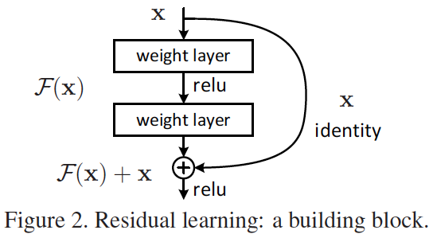

* content
{:toc}
Outline：
========

1. Aritificial Neural Networks
2. Convolutional Neural Networks
3. Loss functions
4. Regularization
5. Optimization
6. Baseline CNN Models

1.Aritificial Neural Networks（ANNs）
-----------------------------------

### Basic Architectures:

1\. a collection of connected units called artificial neurons

2\. organized in layers, signals travel from the first to the last layer

### Activation functions:

1.  Sigmoid ([0,1])
\begin{align}
f(x)= \frac{1}{1+e^{-x}} \quad or \quad f(x)=\frac{1}{1+e^{-\beta x}} \quad b>0
\end{align}


2.  Tangent Sigmod ([-1,1])
\begin{align}
f(x)= \frac{1-e^{-x}}{1+e^{-x}}\quad or \quad f(x)=\frac{1-e^{-bx}}{1+e^{-bx}}\quad b>0
\end{align}


3\. Step function, Linear function...

\begin{align}
f(x)=\left\{ \begin{array}{}
+1 & x\ge 0\\
-1 & x<0\\
\end{array} \right.
\quad
y=f(x)=\left\{ \begin{array}{}
0 & x<0\\
x & 0\le x \le 1\\
1 & x>1
\end{array} \right.
\quad
y=f(x)=\left\{ \begin{array}{}
-1 & x<-1\\
x & -1\le x \le 1\\
1 & x>1
\end{array} \right.
\end{align}


 

### Back-propagation

\begin{align}
& a^l_j-\textrm{the activation of the j-th neuron in the l-th layer}\\
& w^l_{jk}-\textrm{the wight for the connection from the k-th neuron in the (l-1)-th layer to the j-th neuron in the l-th layer}\\
& b^l_j-\textrm{the bias of the j-th neuron in the l-th layer}\\
& \delta^l_j-\textrm{the error of the j-th neuron in the l-th layer}\\
& z^l_j-\textrm{the weighted input to the activation for the j-th neuron in the l-th layer}\\
& \sigma(.)-\textrm{activation function}\\
& E-\textrm{loss function}
\end{align}
\begin{align}
&z^l_j=\sum_{k}w_{jk}^{l}a_{k}^{l-1}+b_j^l （a_j^l接收到的总输入）\\
&a_j^l=\sigma (z^l_j)=\sigma(\sum_{k}w_{jk}^{l}a_{k}^{l-1}+b_j^l) （经过激活函数作用之后该神经元的产出）\\
&\delta_j^l=\frac{\partial E}{\partial z^l_j}（单个神经元的损失，由整体的损失投影到单个神经元上面）
\end{align}

\begin{align}
& \textrm{BP(1):equation for the error in the output layer }\delta^L\\
& \delta^L_j=\frac{\partial E}{\partial z^l_j}=\frac{\partial E}{\partial a^L_j}(\frac{\partial a_j^L}{\partial z_j^l})=\frac{\partial E}{\partial a^L_j}\sigma^{'}(z^L_j)
\end{align}

…具体的BP算法之后再说

### Back-propagation Loop

Phase 1 : Propagation

-Forward propagation —generate the network’s output values.

-Backward propagation —generate the delta(the difference between the target and actual output values) of all output and hidden neurons.

Phase 2 :Weight update

-The weight’s output delta and input activation are multiplied to find the gradient of the weight.

-A ratio(learning rate) of the weight’s gradient is subtracted from the weight.

\begin{align}
\theta^{t+1}\leftarrow \theta^t -\gamma\frac{\partial E}{\partial \theta}
\end{align}

2.Convolutional Neural Networks
-------------------------------

Convolution networks combine:

1. local receptive fields
2. Shared weights(or weight replication)
3. spatial or temporal subsampling

1和2使得参数的数量更少，考虑到了图片的图片的拓扑学原理。

3将图片的旋转和形变考虑了进去。

### Convolution Layer

—一组可对参数进行学习的滤波器。（或者叫做核）

—has small receptive field, but extend through the full depth of the input valume(??)

—滤波器很小，但是对于输入图像整体都进行了滤波。

\begin{align}
x^l_j=f(\sum_{i\in M_j}x^{l-1}_i*k^l_{ij}+b^l_j)
\end{align}

k—kernal parameters

b—bias parameter

f(.)—activation function

Mj—receptive field of last layer

the concolution layer related to convolution of two signals:
element-wise multiplication
sum of a filter and the signal(image)
\begin{align}
f(x,y)*g(x,y)=\sum^{\infty}_{n_1=-\infty}\sum^{\infty}_{n_2=-\infty}f(n_1,n_2)\cdot g(x-n_1,y-n_2)
\end{align}
is same as 
\begin{align}
x^l_j=f(\sum_{i\in M_j}x^{l-1}_i*k^l_{ij}+b^l_j)
\end{align}

Convolution layer has much smaller number of parameters by local cinnection and weight sharing

### Pooling layer

Pooling is a form of non-linear down-sampling

* Max-pooling(most used)
* Mini-pooling
* Average-pooling
* Sum-pooling

The intuition is that the exact(确切的) location of a feature is less import than its rough(非确切的) location relative to other features.

Reduce the effect of noise and shift or distortion

Max-pooling

 

### ReLU=Rectified Linear Unit

**Backgroud:**

* Derivative of sigmoid neuron is always less than 1
* Deep neural networks of sigmoid and hyperbolic units often suffer from vanishing gradients.

\begin{align}
f(x)=max(0,x)\\
f'(x)=\left\{ \begin{array}{}
0 & x<0\\
1 & x\ge0\\
\end{array}\right.
\end{align}

**Advantages：**

—Biological plaisibility: One-sided

—Sparse activation: in a randomly initialized network, only about 50% of hidden units are activated

—efficient gradient propagation: No vanishing or exploding gradient problems.

—only comparison, addition and multiplication

—simplifies back-propagation: make learning faster ; make feature sparse.

**Soft version:Softplus**

\begin{align}
f(x)=ln(1+e^x)\\
f'(x)= \frac{1}{1+e^{-x}}
\end{align}


### Maxout

\begin{align}
f_i(x)=\mathop{max}\limits_{j\in [1,k]}z_{ij}
\end{align}

\\mathop{max} 将max变为数学符号，使用\\limits\_{}将括号内的内容放到max下面

3\. Loss function
-----------------

### 

* Classification loss function
* Regression loss function

### Classfication loss functions:

1. Multiclass SVM loss
2. Softmax loss

1.   Multiclass SVM loss
Given a pair of image and label ($x_i,y_i$), score vector $s =f(x_i,W)$
The SVM loss has the form：
\begin{align}
L_i=\sum_{j\ne y_i}max(0,s_j-s_{y_i}+1) \quad (1)\\
L=\frac{1}{N}\sum^N_{i=1}L_i \quad (2)
\end{align}

对(1)，$L_1$表示对于样本$x_i$进行，候选的标签表示为j(多个)，计算得到对于$x_i$可能的分类结果的概率$s_j$,$y_i$表示对$x_i$的正确分类。

2.  Softmax Classifer(Mutinomial Logistic Regression)
\begin{align}
P(Y=k|X=x_i)=\frac{e^sk}{\sum_je^sj}\quad where\quad s=f(x_i;W)\\
L_i=-logP(Y=y_i|X=x_i)\\
so \quad L_i=-log(\frac{e^sy_i}{\sum_{j}e^sj})
\end{align}
$\sum_je^sj$表示所有候选标签的可能性大小之和

### Regression loss function:

用y表示已知的真实值，$\hat{y}$表示预测值，r表示误差$r=y-\hat{y}$。

1. Square or L2 Loss
2. Absolute or Laplace or L1 Loss
3. Huber Loss

1.  l(r) = $r^2$ (not rubust)
2.  l(r) = |r| (not differentiable)
3.  Quadratic for $|r|\le \delta$ and linear for $|r|>\delta$  (robust and differentiable)


4\. Regularization
------------------

* **L1,L2**
* **Dropout**
* **Batch normalization**

### L1, L2

L1 regularization : lead the weight vector to become sparse during optimization

L2 regularization : the most common form

 Penalize the squared magnitude of all parameters directly in the objective

 Heavily penalize peaky weight vector and prefer diffuse weight vectors

### Dropout

**idea**: randomly “drop” some units from the network when training 

**training**: at each iteration of gradient descent, each input/hidden units is dropped with a certain probability

**Prediction**: multiply the output of each unit by one minus its drop probability

**Intuition**: 

* an approximate form of ensemble learning
* each time, a different sub-network is trained
* Sub-networks are “merged” by averaging their weights

### Batch normalization

Motivation: 

– It would be nice to also ensure whitened activations during training for all layers. 

– Training of networks is complicated because the distribution of layer inputs changes during training (internal covariate(协变量) shift) 

– Making normalization at all layers part of the training prevents the internal covariate shift. 

Advantage: 

– Allows higher learning rates. 

– Reduces the strong dependence on initialization. 

– Slightly reduces the need for dropout.


5\. optimization
----------------

* **Gradient descent**
* **Adagard, Adam…**

（hyperparameter - a fixed constant）**
**

### Gradient Descent

Motivated by the idea to take a step in the direction of the negative gradient, to reach a minimum.

\begin{align}
\theta^{t+1}\quad \leftarrow \theta^t-\gamma \nabla E(\theta)
\end{align}

**1\. SGD=Stochastic Gradient Descent**

a stochastic approximation of the gradient descent,also known as incremental gradient descent 

1. Sample a batch of data
2. Forward prop it through the graph, get loss
3. Backprop to calculate the gradients
4. Update the parameter using the gradient

SGD仅仅包含一个图像，计算并用一个图像更新参数。

you will hear people use the term SGD even when referring to mini-batch gradient descent (i.e. mentions of MGD for “Minibatch Gradient Descent”, or BGD for “Batch gradient descent” are rare to see), where it is usually assumed that mini-batches are used. 

意思是说，在提到SGD的时候，更多的是强调其随机性，而随机使用的样本通常不是一个，而是使用一个batch（即很多的样本一起）

**2\. mini-batch GD **

Use groups(mini-batches) of images to update the parameters.

* Less computation is used
* Balance the classes in each mini-batch
* One round through all data is called an epoc

mini-batch存在的意义是对于每一次的参数更新，没有必要把所有的样本都用来参与计算，而是选择一小部分去做计算，这样减小了计算量。

**3\. Momentum**

Momentum总是能找到优化的最优方向，因为其从物理原理的角度对其进行了解释。  
将损失函数看做是从山坡上的物体想要去地势最低的地方，随机初始化表示将其随意摆放到地图的一个地方。物体拥有能量U=mgh，作用在物体上的力与势能相关，$F=-\nabla U$，而$F=ma$对物体的速度起作用。
与SGD不同的地方在于，SGD中梯度直接作用于物体，直接改变物体的位置。而Momentum SGD中，梯度作用于物体的速度，而速度改变物体的位置。
\begin{align}
v=mu*v-leraning\_rate*dx\\
x+=v
\end{align}
其中dx表示梯度，learning_rate指学习率，mu是一个超参数，事先设定好的一般在0.9周围浮动。mu可以看做现将过程中恒定摩擦力的作用。
对mu的值做一定的调整也有利于优化，一般从0.5开始，到0.99结束（A typical setting is to start with momentum of about 0.5 and anneal it to 0.99 or so over multiple epochs.）
With Momentum update, the parameter vector will build up velocity in any direction that has consistent gradient.

另一种版本的公式是
\begin{align}
d_i=\beta d_{i-1}+g(\theta_{i-1})\\
\theta_i=\theta_{i-1}-\alpha d_i\\
\end{align}
其中$d_i$和$d_{i-1}$分别是这一次和上一次的更新方向，$g(\theta)$表示目标函数在$\theta$处的梯度，$\alpha$是学习率。
其实这两个表达式是一个意思。

这一次下降的方向与上一次下降的方向有关，就像一个小球的滚落受自身历史动量的影响，能够更加平稳快速地下降。

**4\. Nesterov Momentum**

该方法有更好的理论基础，而且效果比3要好。在计算梯度的过程中，使用$x+mu*v$来代替x。
我个人的理解是，x是现在的位置，而$x+mu*v$则是将来要到的那个地方，而在$x+mu*v$的位置的梯度可以计算出来，那么，既然在到达$x+mu*v$位置之后还要继续向着$x+mu*v$的梯度方向前进，那么如果在本次选梯度的时候使用目的地的梯度，会更快地接近最终的优化目标。


Nesterov momentum. Instead of evaluating gradient at the current position (red circle), we know that our momentum is about to carry us to the tip of the green arrow. With Nesterov momentum we therefore instead evaluate the gradient at this "looked-ahead" position.

x_ahead=x+mu*v
v=mu*v-learning_rate*dx_ahead
x+=v
其等价形式：
v_prev=v
v=mu*v-learning_rate*dx
x+=-mu*v_prev+(1+mu)*v

还有另一种表达形式为:
\begin{align}
d_i=\beta d_{i-1}+g(\theta_{i-1}-\alpha\beta d_{i-1})\\
\theta_i=\theta_{i-1}-\alpha d_i
\end{align}
该公式的等效形式为：
\begin{align}
d_i=\beta d_{i-1}+g(\theta_{i-1})+\beta[g(\theta_{i-1}-g(\theta_{i-2})]\\
\theta_i=\theta_{i-1}-\alpha d_i
\end{align}

相比较于Momentum，本次更新方向新增加了一个$\beta[g(\theta_{i-1})-g(\theta_{i-2})]$，其含义很明显，如果这次的梯度要比上一次的大，那么有理由相信之后会变得更大，把预计要增大的部分提前加进来；如果比上一次变小了，则把下一次要减小的提前加进来。
其实这个多加进去的项更像近似目标函数的二阶导数。所以本质上是考虑了目标函数的二阶导信息，因此加速收敛了。
（原始公式到等效公式的推导过程比较复杂，就不上了）

**5\. Annealing the learning rate**

With a high learning rate, the system contains too much kinetic energy and the parameter vector bounces around chaotically, unable to settle down into deeper, but narrower parts of the loss function.

There are three common types of implementing the learning rate decay:

* Step decay: Reduce the learning rate by some factor every few epochs. Typical values might be reducing the learning rate by a half every 5 epochs, or by 0.1 every 20 epochs. These numbers depend heavily on the type of problem and the model. One heuristic you may see in practice is to watch the validation error while training with a fixed learning rate, and reduce the learning rate by a constant (e.g. 0.5) whenever the validation error stops improving.
* Exponential decay. has the mathematical form α=α0e−ktα=α0e−kt, where α0,kα0,k are hyperparameters and tt is the iteration number (but you can also use units of epochs).
* 1/t decay has the mathematical form α=α0/(1+kt)α=α0/(1+kt) where a0,ka0,k are hyperparameters and tt is the iteration number.

In practice, we find that the step decay is slightly preferable

**6\. [Newton’s method](http://en.wikipedia.org/wiki/Newton's_method_in_optimization)**

\begin{align}
x \leftarrow x-[Hf(x)]^{-1}\nabla f(x)
\end{align}
其中
Hf(x) is the Hessian matrix, which is a square matrix of second-order partial derivatives of the function.
∇f(x) is the gradient vector.
Intuitively, the Hessian describes the local curvature of the loss function, which allows us to perform a more efficient update.

BUT, computing (and inverting) the Hessian in its explicit form is a very costly process in both space and time.

the most popular is [L-BFGS](http://en.wikipedia.org/wiki/Limited-memory_BFGS), which uses the information in the gradients over time to form the approximation implicitly (i.e. the full matrix is never computed).

L-BFGS must be computed over the entire training set, which could contain millions of examples. Unlike mini-batch SGD, getting L-BFGS to work on mini-batches is more tricky and an active area of research.

In practice, it is currently not common to see L-BFGS or similar second-order methods applied to large-scale Deep Learning and Convolutional Neural Networks. Instead, SGD variants based on (Nesterov’s) momentum are more standard because they are simpler and scale more easily.

[http://blog.sina.com.cn/s/blog\_eb3aea990101gflj.html](http://blog.sina.com.cn/s/blog_eb3aea990101gflj.html)（参考资料）

**7\. AdaGrad (adaptive gradient algorithm)**

– a modified stochastic gradient descent with per-parameter learning rate

– increase the learning rate for more sparse parameters and decrease the learning rate for less sparse ones(sparse parameters are more informative)

– improve convergence performance in settings where data is sparse

\begin{align}
G=\sum^t_{\tau=1}g_{\tau}g_{\tau}^T,\qquad g=\nabla E(\theta)\\
\theta^{t+1}_j\, \leftarrow\theta^t_j-\frac{\lambda}{G_{jj}}g_j\\
\theta^{t+1}_j\, \leftarrow\theta^t-\lambda diag(G)^{-\frac{1}{2}}\odot\nabla E(\theta)
\end{align}

这几个公式是在说，g是每次计算下来的梯度，G是以往每次所计算下来的梯度值的平方之和，λ是学习步长

cache += dx\*\*2

x += - learning\_rate \* dx / (np.sqrt(cache) + eps)

cache has size equal to the size of the gradient.

the square root operation turns out to be very important and without it the algorithm performs much worse.

The smoothing term eps (usually set somewhere in range from 1e-4 to 1e-8) avoids division by zero.

**8\. RMSprop**

The RMSProp update adjusts the Adagrad method in a very simple way in an attempt to reduce its aggressive, monotonically decreasing learning rate.

```
cache = decay\_rate \* cache + (1 - decay\_rate) \* dx\*\*2
x += - learning\_rate \* dx / (np.sqrt(cache) + eps)
```

`decay_rate` is a hyperparameter and typical values are [0.9, 0.99, 0.999].

**9\. Adam**

[Adam](http://arxiv.org/abs/1412.6980) is a recently proposed update that looks a bit like RMSProp with momentum.

```
m = beta1\*m + (1-beta1)\*dx
v = beta2\*v + (1-beta2)\*(dx\*\*2)
x += - learning\_rate \* m / (np.sqrt(v) + eps)
```

Recommended values in the paper are `eps = 1e-8`, `beta1 = 0.9`, `beta2 = 0.999`.

With the bias correction mechanism, the update looks as follows:

```
\# t is your iteration counter going from 1 to infinity
m = beta1\*m + (1-beta1)\*dx
mt = m / (1-beta1\*\*t)
v = beta2\*v + (1-beta2)\*(dx\*\*2)
vt = v / (1-beta2\*\*t)
x += - learning\_rate \* mt / (np.sqrt(vt) + eps)
```

In practice Adam is currently recommended as the default algorithm to use, and often works slightly better than RMSProp.

6\. Baseline CNN Models
-----------------------

* **LeNet，AlexNet，VGG，GoogleNet，ResNet**

**1\. LeNet-5**

the first successful application of convolutional Networks

about 187000 connection

about 14000 trainable weight

  

**[1] LeCun Y, Bottou L, Bengio Y, et al. Gradient-based learning applied to document recognition[J]. Proceedings of the IEEE, 1998, 86(11): 2278-2324\. **

**2\. AlexNet**

ImageNet ILSVRC challenge 2012 winner

The Network had a very similar architecture to LeNet, but was deeper, bigger.

 

**3\. VGG net**

show that the depth of the network is a critical component for good performance.

only performs 3\*3 convolution and 2\*2 pooling from the beginning to the end.

**4\. GoogleNet**

ImageNet ILSVRC challenge 2014 winner.

reduce the number of parameter in the network.(4M)

**5\. ResNet**

ImageNet ILSVRC challenge 2015 winner.

when deeper network are able to start converging, accuracy gets saturated and then degrades rapidly.

**shortcut connections: it’s easier to optimize the residual mapping than to optimize the original, unreferenced mapping. **

  

  

Training on Cifar-10.
 Bold: validation error. Thin: training error. Left: plain. Right: ResNets. 

ResNet 使用了Residual learning的方法，对于一般的卷积神经网络层数太深出现的问题做出了优化，减小了错误率。

 

